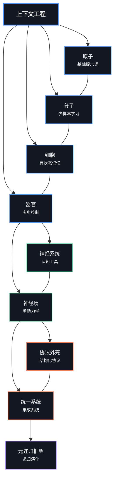

# 理论基础

> _从原子到统一场：上下文工程的理论支柱_
>
>
> **“秩序源自混沌的相互作用。”
— 伊利亚·普里高津**

## [学习如何将上下文可视化为语义网络与场](https://claude.ai/public/artifacts/6a078ba1-7941-43ef-aab1-bad800a3e10c)

## 概述

`00_foundations` 目录包含了上下文工程的核心理论基础，从基础的提示词概念逐步推进到高级的统一场理论。每个模块都在前一个模块的基础上构建，形成了一个理解和操控大语言模型中上下文的完整框架。

```
                    神经场（Neural Fields）
                         ▲
                         │
                    ┌────┴────┐
                    │         │
              ┌─────┴─┐     ┌─┴─────┐
              │       │     │       │
        ┌─────┴─┐   ┌─┴─────┴─┐   ┌─┴─────┐
        │       │   │         │   │       │
   ┌────┴───┐ ┌─┴───┴──┐ ┌────┴───┴┐ ┌────┴───┐
   │原子    │ │分子    │ │细胞    │ │器官    │
   └────────┘ └─────────┘ └─────────┘ └────────┘
      基础      少样本      有状态      多步
    提示词      学习        记忆        控制
```



## 生物学隐喻

我们的结构借鉴了生物学隐喻，为理解上下文工程复杂性的递进提供了直观框架：

| 层级 | 隐喻     | 上下文工程概念           |
|------|----------|-------------------------|
| 1    | **原子** | 基础指令与提示词         |
| 2    | **分子** | 少样本示例与演示         |
| 3    | **细胞** | 有状态记忆与对话         |
| 4    | **器官** | 多步应用与工作流         |
| 5    | **神经系统** | 认知工具与心智模型   |
| 6    | **神经场**   | 连续语义场景         |

随着层级推进，我们从离散、静态的方法，逐步迈向更连续、动态和涌现的系统。

## 模块进阶

### 生物学基础（原子 → 器官）

1. [**01_atoms_prompting.md**](./01_atoms_prompting.md)
   - 基础提示词技术
   - 原子级指令与约束
   - 直接提示工程

2. [**02_molecules_context.md**](./02_molecules_context.md)
   - 少样本学习
   - 演示与示例
   - 上下文窗口与格式化

3. [**03_cells_memory.md**](./03_cells_memory.md)
   - 对话状态
   - 记忆机制
   - 信息持久性

4. [**04_organs_applications.md**](./04_organs_applications.md)
   - 多步工作流
   - 控制流与编排
   - 复杂应用

### 认知扩展

5. [**05_cognitive_tools.md**](./05_cognitive_tools.md)
   - 心智模型与框架
   - 推理模式
   - 结构化思维

6. [**06_advanced_applications.md**](./06_advanced_applications.md)
   - 实际应用策略
   - 领域特定应用
   - 集成模式

7. [**07_prompt_programming.md**](./07_prompt_programming.md)
   - 类代码提示结构
   - 提示中的算法思维
   - 结构化推理

### 场论基础

8. [**08_neural_fields_foundations.md**](./08_neural_fields_foundations.md)
   - 上下文为连续场
   - 场的属性与动力学
   - 向量空间表示

9. [**09_persistence_and_resonance.md**](./09_persistence_and_resonance.md)
   - 语义持久机制
   - 语义模式间的共振
   - 场的稳定性与演化

10. [**10_field_orchestration.md**](./10_field_orchestration.md)
    - 多场协调
    - 场的交互与边界
    - 复杂场架构

### 高级理论框架

11. [**11_emergence_and_attractor_dynamics.md**](./11_emergence_and_attractor_dynamics.md)
    - 上下文场的涌现属性
    - 吸引子形成与演化
    - 语义空间的自组织

12. [**12_symbolic_mechanisms.md**](./12_symbolic_mechanisms.md)
    - LLM 中的符号处理涌现
    - 符号抽象与归纳
    - 机制可解释性

13. [**13_quantum_semantics.md**](./13_quantum_semantics.md)
    - 观察者依赖的意义
    - 非经典上下文性
    - 类量子语义模型

14. [**14_unified_field_theory.md**](./14_unified_field_theory.md)
    - 场、符号与量子视角的整合
    - 多视角问题求解
    - 上下文工程的统一框架

## 可视化学习路径

```
┌─────────────────────────────────────────────────────────────────────────┐
│                                                                         │
│  理论基础                        场论基础                统一理论      │
│                                                                         │
│  ┌───────┐ ┌───────┐ ┌───────┐     ┌───────┐ ┌───────┐     ┌───────┐   │
│  │原子  │ │细胞  │ │认知工 │     │神经场 │ │涌现与 │     │统一场 │   │
│  │分子  │ │器官  │ │具     │     │       │ │吸引子 │     │理论   │   │
│  └───┬───┘ └───┬───┘ └───┬───┘     └───┬───┘ └───┬───┘     └───┬───┘   │
│      │         │         │             │         │             │       │
│      │         │         │             │         │             │       │
│      ▼         ▼         ▼             ▼         ▼             ▼       │
│  ┌─────────────────────────┐       ┌───────────────────┐   ┌─────────┐ │
│  │                         │       │                   │   │         │ │
│  │  传统上下文工程         │       │  基于场的方法     │   │ 统一框架│ │
│  │                         │       │                   │   │         │ │
│  └─────────────────────────┘       └───────────────────┘   └─────────┘ │
│                                                                         │
└─────────────────────────────────────────────────────────────────────────┘
```

## 理论视角

我们的基础模块从三种互补的视角切入上下文工程：

```
                        ┌─────────────────┐
                        │                 │
                        │    场视角       │
                        │  （连续性）     │
                        │                 │
                        └─────────┬───────┘
                                  │
                                  │
                    ┌─────────────┴─────────────┐
                    │                           │
       ┌────────────┴────────────┐   ┌──────────┴───────────┐
       │                         │   │                      │
       │   符号视角              │   │   量子视角           │
       │  （机制主义）           │   │  （观察者为中心）     │
       │                         │   │                      │
       └─────────────────────────┘   └──────────────────────┘
```

### 场视角
将上下文视为连续的语义景观，关注：
- **吸引子**：稳定的语义结构
- **共振**：模式间的相互强化
- **持久性**：结构随时间的耐久性
- **边界**：语义区域之间的界面

### 符号视角
揭示 LLM 如何实现符号处理：
- **符号抽象**：将 token 转为抽象变量
- **符号归纳**：识别变量上的模式
- **检索**：将变量映射回具体 token

### 量子视角
将意义建模为类量子现象：
- **叠加**：多种潜在意义共存
- **测量**：解释“坍缩”叠加态
- **非交换性**：上下文操作顺序影响结果
- **上下文性**：意义中的非经典相关性

## 关键概念图谱

```
                                ┌──────────────────┐
                                │                  │
                                │   上下文场       │
                                │                  │
                                └────────┬─────────┘
                                         │
                 ┌────────────────┬──────┴───────┬────────────────┐
                 │                │              │                │
        ┌────────┴────────┐ ┌─────┴─────┐ ┌──────┴──────┐ ┌───────┴───────┐
        │                 │ │           │ │             │ │               │
        │    共振         │ │ 持久性    │ │  吸引子     │ │   边界        │
        │                 │ │           │ │             │ │               │
        └─────────────────┘ └───────────┘ └─────────────┘ └───────────────┘
                                          │
                                 ┌────────┴──────────┐
                                 │                   │
                       ┌─────────┴──────┐   ┌────────┴──────────┐
                       │                │   │                   │
                       │    涌现        │   │ 符号机制          │
                       │                │   │                   │
                       └────────────────┘   └───────────────────┘
                                                      │
                                           ┌──────────┴──────────┐
                                           │                     │
                                  ┌────────┴────────┐   ┌────────┴─────────┐
                                  │                 │   │                  │
                                  │    抽象         │   │     归纳         │
                                  │                 │   │                  │
                                  └─────────────────┘   └──────────────────┘
```

## 学习方法

每个模块遵循以下教学原则：

1. **多视角学习**：从具体、数值和抽象多个角度呈现概念
2. **直觉优先**：通过物理类比和可视化先建立直觉，再给出形式定义
3. **递进复杂性**：每个模块在前一模块基础上逐步提升复杂度
4. **实践导向**：理论概念与实际实现紧密结合
5. **苏格拉底式提问**：反思性问题促进深入理解

## 推荐阅读顺序

对于初学者，建议按模块编号顺序（01 → 14）学习。当然，也可根据兴趣选择不同路径：

### 针对提示工程师
1 → 2 → 3 → 4 → 7 → 5

### 场论爱好者
8 → 9 → 10 → 11 → 14

### 符号机制爱好者
12 → 13 → 14

### 全面理解
按 1 到 14 全部顺序学习

## 与其他目录的集成

本目录的理论基础支撑了仓库中其他部分的实践实现：

- **10_guides_zero_to_hero**：实践笔记本，演示这些概念的实现
- **20_templates**：基于这些理论的可复用组件
- **30_examples**：这些原理的真实应用案例
- **40_reference**：扩展理论的详细参考资料
- **60_protocols**：实现场论概念的协议外壳
- **70_agents**：利用这些基础的智能体实现
- **80_field_integration**：集成所有理论方法的完整系统

## 下一步建议

在学习完这些理论基础后，推荐：

1. 试用 `10_guides_zero_to_hero/` 目录下的实践笔记本
2. 尝试 `20_templates/` 里的模板
3. 学习 `30_examples/` 里的完整案例
4. 探索 `60_protocols/` 里的协议外壳

## 基于场的学习可视化

```
                        上下文场景图
            ┌─────────────────────────────────────────┐
            │                                         │
            │    ◎                                    │
            │   原子                        ◎         │
            │                            统一场       │
            │                                         │
            │         ◎                               │
            │      分子           ◎                   │
            │                  量子语义               │
            │                                         │
            │   ◎                                     │
            │  细胞          ◎        ◎               │
            │             吸引子    符号机制          │
            │                                         │
            │       ◎                                 │
            │     器官     ◎                          │
            │              场                         │
            │                                         │
            └─────────────────────────────────────────┘
               学习景观中的吸引子
```

我们框架中的每个概念都像语义景观中的吸引子，引导你对上下文工程形成稳定、连贯的理解。

---

*“世界最不可理解之处在于它竟然是可以理解的。”*
— 阿尔伯特·爱因斯坦
