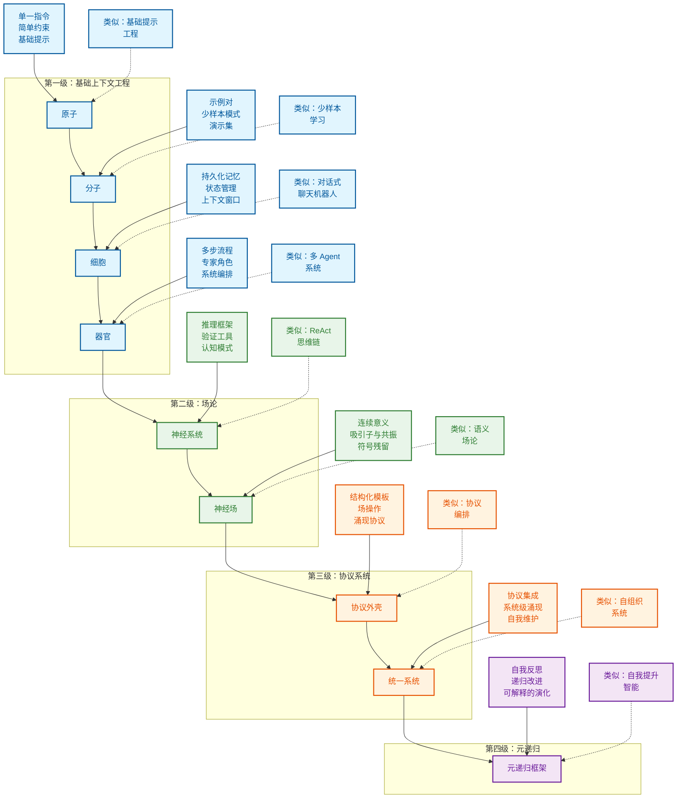

# 上下文工程
为您带来关于上下文的最新研究，涵盖第一性原理与可视化——汇集自 ICML、IBM、NeurIPS、OHBM 等机构的 2025 年 6 月研究成果

> **“为 GPT-4.1 提供我们的‘认知工具’后，其在 AIME2024 上的 pass@1 性能从 26.7% 提升至 43.3%，使其非常接近 o1-preview 的性能。”** — [**苏黎世 IBM 研究院**](https://www.arxiv.org/pdf/2506.12115)

<div align="center">

## [苏黎世 IBM 研究院](https://www.arxiv.org/pdf/2506.12115) | [量子语义学](https://arxiv.org/pdf/2506.10077) | [ICML 普林斯顿大学](https://openreview.net/forum?id=y1SnRPDWx4) | [MEM1 新加坡-麻省理工学院](https://arxiv.org/pdf/2506.15841) | [LLM 吸引子 上海 AI](https://arxiv.org/pdf/2502.15208?)

### [动力系统理论入门](https://content.csbs.utah.edu/~butner/systems/DynamicalSystemsIntro.html) | [哥伦比亚大学 DST](http://wordpress.ei.columbia.edu/ac4/about/our-approach/dynamical-systems-theory/)

## [DeepWiki 文档](https://deepwiki.com/davidkimai/Context-Engineering)

## [](https://deepwiki.com/davidkimai/Context-Engineering)

</div>

> **“上下文工程是一门精巧的艺术与科学，旨在用恰到好处的信息填充上下文窗口，为下一步做准备。” — [**Andrej Karpathy**](https://x.com/karpathy/status/1937902205765607626)**

<div align="center">


https://github.com/user-attachments/assets/9f046259-e5ec-4160-8ed0-41a608d8adf3


</div>

一份基于第一性原理的实践手册，旨在帮助您从提示工程走向更广阔的上下文设计、编排和优化领域。

```
                    提示工程             │  上下文工程
                       ↓                   │            ↓
               “你所说的内容”            │  “模型看到的其他所有内容”
             （单一指令）                │    （示例、记忆、检索、
                                         │     工具、状态、控制流）
```

## 为何创建此代码库

> **“意义并非语义表达的内在静态属性，而是通过表达式与特定语境中的解释代理之间的动态交互而实现的涌现现象。”
— [Agostino 等人 — 2025 年 6 月，印第安纳大学](https://arxiv.org/pdf/2506.10077)**

提示工程备受关注，但现在我们可以期待接下来的发展。一旦你掌握了提示，真正的力量来自于工程化围绕这些提示的**整个上下文窗口**。可以说是引导思维。

本代码库提供了一种渐进的、基于第一性原理的上下文工程方法，并围绕一个生物学隐喻构建：

> 细胞 = Agent
>
> 器官 = 多 Agent 系统

```
原子 → 分子 → 细胞 → 器官 → 神经系统 → 神经与语义场理论
  │      │       │      │         │                  │
单一   少样本    记忆/   多 Agent  认知工具 +        上下文 = 场 +
提示   示例      Agent            提示程序          持久性与共振
```
> “抽象是泛化的代价” — [**Grant Sanderson (3Blue1Brown)**](https://www.3blue1brown.com/)


```python
Context-Engineering/
├── structure.md                     # 原始结构图
├── STRUCTURE_v2.md                  # 带有场论的增强结构图
├── context.json                     # 原始 schema 配置
├── context_v2.json                  # 带有场协议的扩展 schema
├── context_v3.json                  # 神经场扩展
├── context_v3.5.json                # 符号机制集成
├── CITATIONS.md                     # 研究参考文献和关联
│
├── 00_foundations/                  # 第一性原理理论
│   ├── 01_atoms_prompting.md        # 原子指令单元
│   ├── 02_molecules_context.md      # 少样本示例/上下文
│   ├── 03_cells_memory.md           # 有状态的对话层
│   ├── 04_organs_applications.md    # 多步控制流
│   ├── 05_cognitive_tools.md        # 心智模型扩展
│   ├── 06_advanced_applications.md  # 真实世界实现
│   ├── 07_prompt_programming.md     # 类代码的推理模式
│   ├── 08_neural_fields_foundations.md # 将上下文视为连续场
│   ├── 09_persistence_and_resonance.md # 场动力学与吸引子
│   ├── 10_field_orchestration.md    # 协调多个场
│   ├── 11_emergence_and_attractor_dynamics.md # 涌现属性
│   │── 12_symbolic_mechanisms.md    # LLM 中的符号推理
│   ├── 13_quantum_semantics.md      # 多重意义（叠加态）
│   └── 14_unified_field_theory.md   # 整合理论模型
│
├── 10_guides_zero_to_hero/          # 动手实践教程
│   ├── 01_min_prompt.ipynb          # 最小化提示实验
│   ├── 02_expand_context.ipynb      # 上下文扩展技术
│   ├── 03_control_loops.ipynb       # 流程控制机制
│   ├── 04_rag_recipes.ipynb         # 检索增强模式
│   ├── 05_protocol_bootstrap.ipynb  # 场协议引导
│   ├── 06_protocol_token_budget.ipynb # 协议效率
│   ├── 07_streaming_context.ipynb   # 实时上下文
│   ├── 08_emergence_detection.ipynb # 检测涌现
│   ├── 09_residue_tracking.ipynb    # 追踪符号残留
│   └── 10_attractor_formation.ipynb # 创建场吸引子
│
├── 20_templates/                    # 可复用组件
│   ├── minimal_context.yaml         # 基础上下文结构
│   ├── control_loop.py              # 编排模板
│   ├── scoring_functions.py         # 评估指标
│   ├── prompt_program_template.py   # 程序结构模板
│   ├── schema_template.yaml         # Schema 定义模板
│   ├── recursive_framework.py       # 递归上下文模板
│   ├── field_protocol_shells.py     # 场协议模板
│   ├── symbolic_residue_tracker.py  # 残留追踪工具
│   ├── context_audit.py             # 上下文分析工具
│   ├── shell_runner.py              # 协议外壳运行器
│   ├── resonance_measurement.py     # 场共振指标
│   ├── attractor_detection.py       # 吸引子分析工具
│   ├── boundary_dynamics.py         # 边界操作工具
│   └── emergence_metrics.py         # 涌现测量
│
├── 30_examples/                     # 实践案例
│   ├── 00_toy_chatbot/              # 简单对话 Agent
│   ├── 01_data_annotator/           # 数据标注系统
│   ├── 02_multi_agent_orchestrator/ # Agent 协作系统
│   ├── 03_vscode_helper/            # IDE 集成
│   ├── 04_rag_minimal/              # 最小化 RAG 实现
│   ├── 05_streaming_window/         # 实时上下文演示
│   ├── 06_residue_scanner/          # 符号残留演示
│   ├── 07_attractor_visualizer/     # 场可视化
│   ├── 08_field_protocol_demo/      # 协议演示
│   └── 09_emergence_lab/            # 涌现实验
│
├── 40_reference/                    # 深度文档
│   ├── token_budgeting.md           # Token 优化策略
│   ├── retrieval_indexing.md        # 检索系统设计
│   ├── eval_checklist.md            # PR 评估标准
│   ├── cognitive_patterns.md        # 推理模式目录
│   ├── schema_cookbook.md           # Schema 模式集合
│   ├── patterns.md                  # 上下文模式库
│   ├── field_mapping.md             # 场论基础
│   ├── symbolic_residue_types.md    # 残留分类
│   ├── attractor_dynamics.md        # 吸引子理论与实践
│   ├── emergence_signatures.md      # 检测涌现
│   └── boundary_operations.md       # 边界操作指南
│
├── 50_contrib/                      # 社区贡献
│   └── README.md                    # 贡献指南
│
├── 60_protocols/                    # 协议外壳与框架
│   ├── README.md                    # 协议概览
│   ├── shells/                      # 协议外壳定义
│   │   ├── attractor.co.emerge.shell      # 吸引子协同涌现
│   │   ├── recursive.emergence.shell      # 递归场涌现
│   │   ├── recursive.memory.attractor.shell # 记忆持久化
│   │   ├── field.resonance.scaffold.shell  # 场共振
│   │   ├── field.self_repair.shell        # 自我修复机制
│   │   └── context.memory.persistence.attractor.shell # 上下文持久化
│   ├── digests/                     # 简化协议文档
│   └── schemas/                     # 协议 schemas
│       ├── fractalRepoContext.v3.5.json    # 代码库上下文
│       ├── fractalConsciousnessField.v1.json # 场 schema
│       ├── protocolShell.v1.json           # 外壳 schema
│       ├── symbolicResidue.v1.json         # 残留 schema
│       └── attractorDynamics.v1.json       # 吸引子 schema
│
├── 70_agents/                       # Agent 演示
│   ├── README.md                    # Agent 概览
│   ├── 01_residue_scanner/          # 符号残留检测
│   ├── 02_self_repair_loop/         # 自我修复协议
│   ├── 03_attractor_modulator/      # 吸引子动力学
│   ├── 04_boundary_adapter/         # 动态边界调整
│   └── 05_field_resonance_tuner/    # 场共振优化
│
├── 80_field_integration/            # 完整场项目
│   ├── README.md                    # 集成概览
│   ├── 00_protocol_ide_helper/      # 协议开发工具
│   ├── 01_context_engineering_assistant/ # 基于场的助手
│   ├── 02_recursive_reasoning_system/    # 递归推理系统
│   ├── 03_emergent_field_laboratory/     # 场实验
│   └── 04_symbolic_reasoning_engine/     # 符号推理引擎
│
├── cognitive-tools/                 # 高级认知框架
│   ├── README.md                    # 概览与快速入门指南
│   ├── cognitive-templates/         # 推理模板
│   │   ├── understanding.md         # 理解操作
│   │   ├── reasoning.md             # 分析操作
│   │   ├── verification.md          # 检查与验证
│   │   ├── composition.md           # 组合多个工具
│   │   └── emergence.md             # 涌现推理模式
│   │
│   ├── cognitive-programs/          # 结构化提示程序
│   │   ├── basic-programs.md        # 基础程序结构
│   │   ├── advanced-programs.md     # 复杂程序架构
│   │   ├── program-library.py       # Python 实现
│   │   ├── program-examples.ipynb   # 交互式示例
│   │   └── emergence-programs.md    # 涌现程序模式
│   │
│   ├── cognitive-schemas/           # 知识表示
│   │   ├── user-schemas.md          # 用户信息 schemas
│   │   ├── domain-schemas.md        # 领域知识 schemas
│   │   ├── task-schemas.md          # 推理任务 schemas
│   │   ├── schema-library.yaml      # 可复用 schema 库
│   │   └── field-schemas.md         # 场表示 schemas
│   │
│   ├── cognitive-architectures/     # 完整推理系统
│   │   ├── solver-architecture.md   # 问题解决系统
│   │   ├── tutor-architecture.md    # 教育系统
│   │   ├── research-architecture.md # 信息综合
│   │   ├── architecture-examples.py # 实现示例
│   │   └── field-architecture.md    # 基于场的架构
│   │
│   └── integration/                 # 集成模式
│       ├── with-rag.md              # 与 RAG 集成
│       ├── with-memory.md           # 与记忆集成
│       ├── with-agents.md           # 与 Agent 集成
│       ├── evaluation-metrics.md    # 有效性测量
│       └── with-fields.md           # 与场协议集成

```

## 快速入门

1.  **阅读 `00_foundations/01_atoms_prompting.md`** (5 分钟)
    理解为什么仅靠提示往往表现不佳

2.  **运行 `10_guides_zero_to_one/01_min_prompt.py (Jupyter Notebook 风格)`**
    体验一个最小可用示例

3.  **探索 `20_templates/minimal_context.yaml`**
    复制/粘贴一个模板到你自己的项目中

4.  **研究 `30_examples/00_toy_chatbot/`**
    查看一个带有上下文管理的完整实现

## 学习路径

```
┌─────────────────┐     ┌──────────────────┐     ┌────────────────┐
│ 00_foundations/ │     │ 10_guides_zero_  │     │ 20_templates/  │
│                 │────▶│ to_one/          │────▶│                │
│ 理论与核心      │     │ 动手实践         │     │ 复制粘贴       │
│ 概念            │     │ 教程             │     │ 代码片段       │
└─────────────────┘     └──────────────────┘     └────────────────┘
         │                                                │
         │                                                │
         ▼                                                ▼
┌─────────────────┐                             ┌────────────────┐
│ 40_reference/   │◀───────────────────────────▶│ 30_examples/   │
│                 │                             │                │
│ 深度剖析与      │                             │ 真实项目，     │
│ 评估手册        │                             │ 难度渐进       │
└─────────────────┘                             │                │
         ▲                                      └────────────────┘
         │                                                ▲
         │                                                │
         └────────────────────┐               ┌───────────┘
                              ▼               ▼
                         ┌─────────────────────┐
                         │ 50_contrib/         │
                         │                     │
                         │ 社区                │
                         │ 贡献                │
                         └─────────────────────┘
```

## 你将学到什么

| 概念 | 是什么 | 为何重要 |
|---------|------------|----------------|
| **Token 预算** | 优化你上下文中的每一个 Token | 更多的 Token = 更高的成本和更慢的响应 |
| **少样本学习** | 通过展示示例来教学 | 通常比单纯解释效果更好 |
| **记忆系统** | 在多轮对话中持久化信息 | 实现有状态、连贯的交互 |
| **检索增强** | 查找并注入相关文档 | 使响应基于事实，减少幻觉 |
| **控制流** | 将复杂任务分解为多个步骤 | 用更简单的提示解决更难的问题 |
| **上下文精简** | 移除不相关的信息 | 只保留对性能必要的内容 |
| **指标与评估** | 衡量上下文的有效性 | 在 Token 使用与质量之间进行迭代优化 |
| **认知工具与提示编程** | 学习构建自定义工具和模板 | 提示编程为上下文工程开启了新的层次 |
| **神经场理论** | 将上下文视为一个神经场 | 将上下文建模为动态神经场，允许迭代更新上下文 |
| **符号机制** | 符号架构支持更高阶的推理 | 更智能的系统 = 更少的工作 |
| **量子语义学** | 意义依赖于观察者 | 设计利用叠加态技术的上下文系统 |

## Karpathy + 3Blue1Brown 启发风格

> 面向所有经验水平的学习者

1.  **第一性原理** – 从最基本的上下文开始
2.  **迭代添加** – 只添加模型明确缺乏的部分
3.  **衡量一切** – Token 成本、延迟、质量得分
4.  **无情删除** – 精简胜于填充
5.  **代码 > 幻灯片** – 每个概念都有可运行的代码单元
6.  **可视化一切** — 每个概念都用 ASCII 和符号图进行可视化

# 研究证据
## 记忆 + 推理

### **[MEM1: 学习协同记忆与推理以实现高效的长时程 Agent - 新加坡-麻省理工学院 2025 年 6 月](https://www.arxiv.org/pdf/2506.12115)**

> “我们的结果表明，以推理驱动的记忆整合作为一种可扩展的替代方案，有望用于训练长时程交互式 Agent，其中效率和性能都得到了优化。” — [新加坡-麻省理工学院](https://arxiv.org/pdf/2506.15841)


1.  **MEM1 训练 AI Agent 只保留重要的信息——在每一步都融合记忆和推理——这样无论任务多长，它们都不会被信息淹没。**

2.  **MEM1 不会无休止地堆积上下文，而是将每次交互压缩成一个紧凑的“内部状态”，就像一个不断更新而非重复抄写的智能笔记。**

3.  **通过将记忆和思考融合成一个单一流程，MEM1 学会只记住要点——使 Agent 更快、更敏锐，并能处理更长的对话。**

4.  **Agent 的所有行为都被标记和结构化，因此每个动作、问题或事实都清晰且易于审计——不再有模糊不清的记忆。**

5.  **在每个周期中，旧的杂乱信息被清除，只有最新、最相关的见解被保留下来，这模仿了专家解决问题时提炼笔记的方式。**

6.  **MEM1 证明，递归的、协议驱动的记忆——即你总是提炼和整合——在速度和准确性上都优于传统的“只管增加上下文”的方法。**
## 认知工具

### **[利用认知工具引发语言模型中的推理 - 苏黎世 IBM 研究院 2025 年 6 月](https://www.arxiv.org/pdf/2506.12115)**

### 作为推理工具调用的提示和提示程序
> “认知工具”将推理操作封装在 LLM 自身内部 — [苏黎世 IBM 研究院](https://www.arxiv.org/pdf/2506.12115)


> **这些认知工具（作为工具调用的结构化提示模板）通过识别手头的核心概念、提取问题中的相关信息，并高亮显示可能有助于解决问题的有意义的属性、定理和技巧，从而分解问题。**


> **这些模板构建了类似于认知心理捷径的推理层，通常被称为“启发式方法”。**

1.  **这项研究表明，将复杂任务分解为模块化的“认知工具”，能让 AI 更深思熟虑地解决问题——模仿了专家人类逐步推理的方式。**

2.  **模型不再依赖于一个庞大、单一的提示，而是调用专门的提示模板，即认知工具，如“理解问题”、“回忆相关知识”、“检查答案”和“回溯”——每个工具处理一个独特的思维操作。**

3.  **认知工具就像内在的思维捷径：AI 在每个阶段选择正确的程序并运行它，以规划其推理和下游行动，从而在执行任务前获得更高的准确性和灵活性。**

4.  **通过将推理步骤划分到模块化的块中，这些工具可以防止混淆、减少错误，并使模型的思维过程透明且可审计——即使在处理困难的数学问题时也是如此。**

5.  **这种模块化方法提升了开源和闭源模型——在解决真实世界的数学问题方面表现更佳，并且在无需额外训练的情况下，接近了经过高级强化学习训练的“推理”模型的性能。**

6.  **结果表明，强大推理的种子已经存在于大型语言模型内部——认知工具只是解锁和编排了这些能力，提供了一种透明、高效且可解释的替代方案来替代黑箱微调。**
## 涌现的符号

## **[大型语言模型中涌现的符号机制支持抽象推理 - ICML 普林斯顿大学 2025 年 6 月 18 日](https://openreview.net/forum?id=y1SnRPDWx4)**


> **一句话总结：研究识别出一个三阶段架构，它通过一套涌现的符号处理机制来支持 LLM 中的抽象推理。**

**这包括符号归纳头、符号抽象头和检索头。**

**1. 在早期层，符号抽象头根据输入 Token 之间的关系将它们转换为抽象变量。**

**2. 在中间层，符号归纳头对这些抽象变量执行序列归纳。**

**3. 最后，在后期层，检索头通过检索与预测的抽象变量相关联的值来预测下一个 Token。**

**这些结果为符号方法与神经网络方法之间长期存在的争论提供了一个解决方案，表明神经网络中的涌现推理依赖于符号机制的涌现。** — [**ICML 普林斯顿大学**](https://openreview.net/forum?id=y1SnRPDWx4)


>
> **为何有用？**
>
>
> **这解释了为什么 Markdown、Json 和类似的结构化、符号化格式更容易被 LLM 解析**
>
> **概念：与 Agent 协作，应用分隔符、语法、符号、符号性词汇、隐喻和结构，以在推理期间改善推理/上下文/记忆/持久性**

1.  **这篇论文证明，大型语言模型会发展出自己内部的符号“逻辑电路”——使其能够用抽象变量进行推理，而不仅仅是表面的词语模式。**

2.  **LLM 表现出一个三阶段过程：首先从输入中抽象出符号，然后对这些变量进行推理，最后将抽象答案映射回现实世界的 Token。**

3.  **这些涌现的机制意味着 LLM 不仅仅是记忆——它们实际上创建了内部的、灵活的表示，使其能够泛化到新的问题和类比。**

4.  **早期层的注意力头充当“符号提取器”，中间层的头执行符号推理，而后期层的头则检索具体答案——这模仿了类似人类的抽象和检索过程。**

5.  **通过进行有针对性的实验和干预，作者们表明，这些符号过程对于抽象推理既是必要的也是充分的，这在多个模型和任务中都得到了验证。**

6.  **研究结果弥合了符号 AI 和神经网络之间的历史鸿沟——表明在规模化的情况下，神经网络可以发明并使用符号机制，从而支持真正的泛化和推理。**
## 正在建设中


## 致谢
> 我一直期待这个概念能够被理论化和形式化，因为之前没有一个成熟的领域。提示工程受到了相当多的污名，并且并不能完全涵盖大多数研究人员和我所做的工作。

- [Andrej Karpathy](https://x.com/karpathy/status/1937902205765607626) 创造了“上下文工程”一词并启发了本代码库
- 所有贡献者和开源社区
